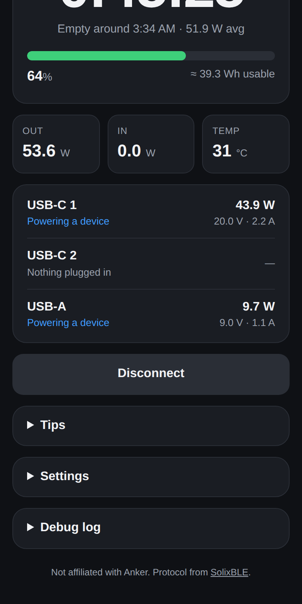

# Anker Time Left

A live **time-until-empty** countdown for the **Anker Prime Power Bank 20K 220W (A110B)**.
It's a web page that connects to the bank over Bluetooth, reads battery % and watts per port every few seconds, and shows a smoothed countdown. When you plug the bank in to charge, it switches to **time until full**.



## Using it on iPhone

Safari and Chrome on iOS don't let web pages use Bluetooth, so use **Bluefy**:

1. Install **Bluefy – Web BLE Browser** (free) from the App Store.
2. **Fully close the Anker app** by swiping it away. The bank only accepts one app connection at a time.
3. Open the site URL (see *Hosting* below) in Bluefy and tap **Connect to power bank**.
4. Pick the bank from the list. If it isn't listed, press the bank's button once to wake its Bluetooth, or tap *Show all devices*.
5. Keep the page on screen. The app asks the phone to keep the screen awake while it's connected; iOS pauses Bluetooth for pages in the background.

On Android, desktop Chrome and Edge it works in the normal browser.

Tap **Try demo mode** to see the UI without the bank.

## How the estimate works

- **Usable energy**: 72.36 Wh (20,100 mAh × 3.6 V) × 85 % conversion efficiency ≈ 61.5 Wh from 100 % to empty.
- **Self-calibrating**: once the battery has dropped a few whole percent while connected, the app measures how many Wh your bank really delivered per percent and blends that into the estimate. The value is saved in the browser. Settings shows it, and you can reset it there.
- **Steady, not jumpy**: power draw is averaged over the last 3 minutes (adjustable), so noisy loads like phones even out. A sustained change, such as unplugging a laptop, restarts the average within about 30 s.
- **Bad readings ignored**: packets missing port data or with impossible values are skipped (and noted in the debug log).
- **Between % ticks** the app interpolates the charge from the measured watts, so the countdown moves every second instead of jumping each time the percentage changes.
- **Charging**: time to full assumes about 90 % input efficiency and a slower last 10 %.

## Can it show on the bank's own screen?

No. The bank's display is drawn by Anker's firmware, and the Bluetooth protocol has no command to put custom text on it. Changing that would mean flashing modified firmware, which could brick the bank or disable its battery safety features.

## Hosting

It's a static site with no build step and no server. Any HTTPS host works, because Web Bluetooth requires HTTPS.

**GitHub Pages** (workflow included): merge to `main`, then go to *Settings → Pages → Source: GitHub Actions*. The site is published at `https://<user>.github.io/Anker-Time-Left/`.
GitHub Pages on a **private** repo needs a paid GitHub plan. Otherwise make the repo public; it contains no secrets.

Local development:

```sh
python3 -m http.server 8000   # then open http://localhost:8000
node --test                   # protocol + estimator tests
```

### Releasing a new version

Add an entry at the top of `js/changelog.js`, then bump every `?v=` in `index.html`, `js/app.js`, `js/ble.js` and `js/estimator.js` to the new number (the query string stops phones running cached scripts). `node --test` fails if the two don't match.

## Project layout

| File | What it does |
| --- | --- |
| `js/protocol.js` | Anker Prime BLE protocol: packet framing, AES-GCM + ECDH handshake, A110B telemetry decoding |
| `js/ble.js` | Web Bluetooth connection, handshake retries, auto-reconnect |
| `js/estimator.js` | Smoothing, calibration and the time-left maths |
| `js/app.js` | UI, demo mode, settings |
| `js/changelog.js` | The in-app "What's new" list; its newest entry sets the app version |
| `test/` | Tests, including real captured packets from SolixBLE |

## Credits

The Bluetooth protocol was reverse-engineered by [SolixBLE](https://github.com/flip-dots/SolixBLE) (MIT). `js/protocol.js` is a JavaScript port of it; see `THIRD_PARTY_NOTICES.md`.
This project is not affiliated with Anker.
